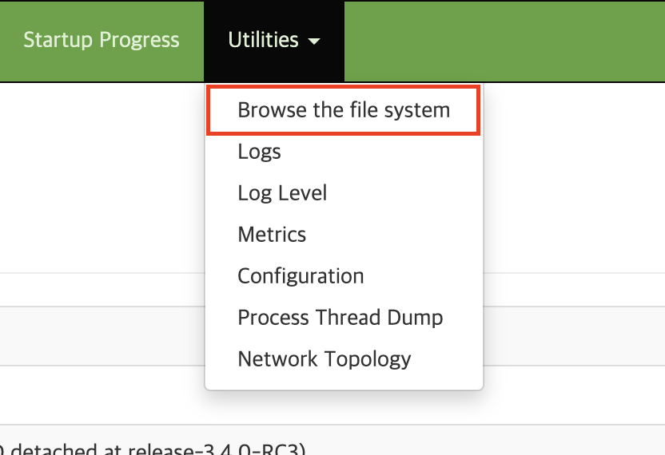
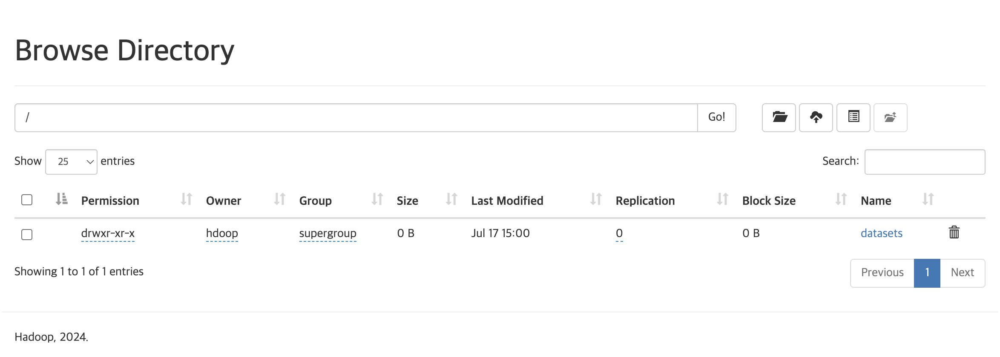
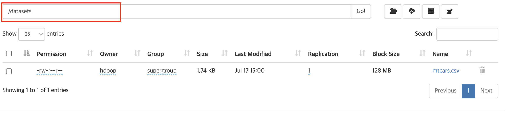
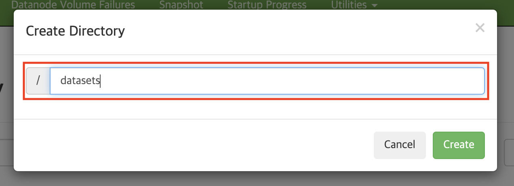
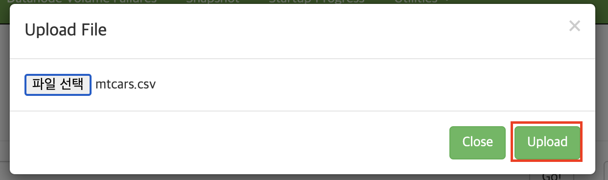

# Hadoop single node cluster

## Build the docker image
```bash
docker build --tag docker-softeer:latest .
```

## Run docker container
```bash
docker run -it -p 9870:9870 -p 8088:8088 -p 9864:9864 --hostname localhost --name hadoop hadoop-softeer:latest
```

## Retrieve the file
1. Connect to http://localhost:9870/ with browser.
2. Click 'Utilities' in the navigation bar.

3. Click 'Browser the file system' under 'Utilites'.

4. You can see the file list of the root directory

5. If you want to go into the subdirectory, click the name of the subdirectory.

6. You can find where you here.


## Create the new directory in HDFS
1. Click the folder button.

2. Type the name of the new directory in the input bar.

3. Click 'Create'


## Upload a file in HDFS
1. Click cloud button

2. Click 'Choose files' button

3. Select the file to upload
4. Click 'Upload' button
